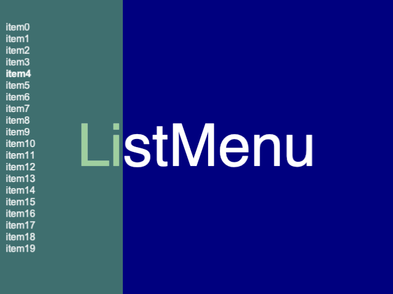
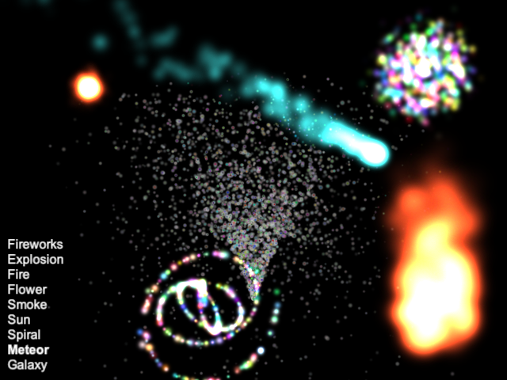

Reference
=========

This section presents the different demo examples.
Each scene is implemented as a layer.

ListMenu
--------

The ListMenu class allows to display a menu of list items.

.. automodule:: listmenu

.. autoclass:: ListMenu
   :members: cb, on_key_press
   :undoc-members:
   :member-order: 'bysource'
   :show-inheritance:

Particle systems
----------------

Particle systems are used to create special effects such as fire or smoke.

.. automodule:: particle_systems
   :members:

Inspector
---------

.. automodule:: inspector
   :members:
   :undoc-members:
   :member-order: 'bysource'
   :show-inheritance:

mylib
-----

.. automodule:: mylib
   :members:

demo
----

.. automodule:: demo
   :members:

